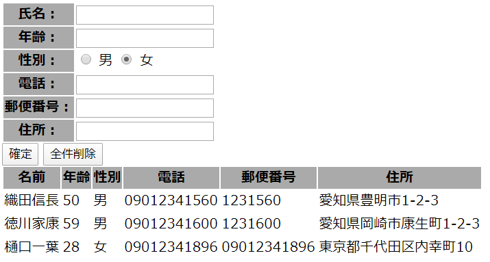

# github-heroku-travis-jest-app 
## ■概要 
TravisCIでGitHubリポジトリからHerokuへのデプロイサンプル。 
アプリはNode.js+Expressで作成し、JESTでテストするように実装されています。 
このリポジトリにPUSHされた実装は、Travis CIでテストされたのちにHerokuにデプロイされ、下記のURLで公開される。 
https://github-heroku-travis-jest-app.herokuapp.com/  
 
## ■アプリの使い方 
Herokuのアドレスを開くと以下の画面が表示されます。 
データ入力と入力したデータの一覧表示はこの画面１枚で行われます。 
これ以外の画面はありません。 
 
1. 各項目に値を入力 
   入力文字のフォーマットチェックはやっていません
2. 「確定」ボタンを押すと下側のリストに追加されます
3. 「全件削除」ボタンを押すと入力済みのデータがすべて削除されます。

## ■Travis CI連携
Travis CIの実行ログはこちら 
https://travis-ci.org/misc-hiro4/github-heroku-travis-jest-app  
テスト終了後のログ出力はけしからん！というログが出てますが、本番環境に影響ないのでしばし放置。 

## ■アプリのファイル構成
| ファイル名 | 説明 |
|:--:|:--:|
| app.js | WEBからの処理（ルーティング）を行っているメイン部分 |
| server.js | WEBからのリクエストをListenする処理 |
| views/index.js | WEBに表示される画面 データ入力(form)と表示を1画面に実装  EJSのテンプレートで実装 |
| app.test.js | Travis CIで実行されるテストを実装   JESTフレームワークで実装している |

## ■利用しているパッケージ
npmでインストールしているパッケージはこちら 
#### ー 実行環境
--saveオプションでインストール、　package.jsonの"dependencies"キーに設定 

|Express|EJS|NeDB|
|:---:|:---:|:---:|

#### ー 開発環境
--saveオプションでインストール、　package.jsonの"devDependencies"キーに設定 
ローカルリポジトリでの確認、Travis CIでのテスト実行時に使う。 
Herokuの本番環境では使わない。

|jest|supertest|
|:--:|:--:|
